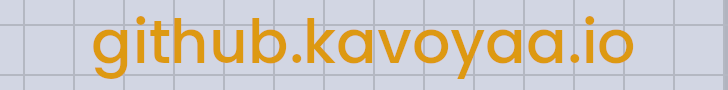

# 
# 👋🏼 Hey there!
I'm **Kavya**, a high school student from India with a knack for programming. 
I am interested in everything computer science and always open to learning new technologies. 

- 🌱 Currently learning **Flask**.
- 📫 Reach out to me through [LinkedIn](https://www.linkedin.com/in/kav-pandey) or [Email](mailto:pandeykavya@outlook.com)!
- ⚡ Fun fact: My favourite font is **Poppins**!

<!--
**Kavoyaa/kavoyaa** is a ✨ _special_ ✨ repository because its `README.md` (this file) appears on your GitHub profile.

Here are some ideas to get you started:

- 🔭 I’m currently working on ...
- 🌱 I’m currently learning ...
- 👯 I’m looking to collaborate on ...
- 🤔 I’m looking for help with ...
- 💬 Ask me about ...
- 📫 How to reach me: ...
- 😄 Pronouns: ...
- ⚡ Fun fact: ...
-->

## 🧑🏼‍💻 Skills

## 📊 Stats

